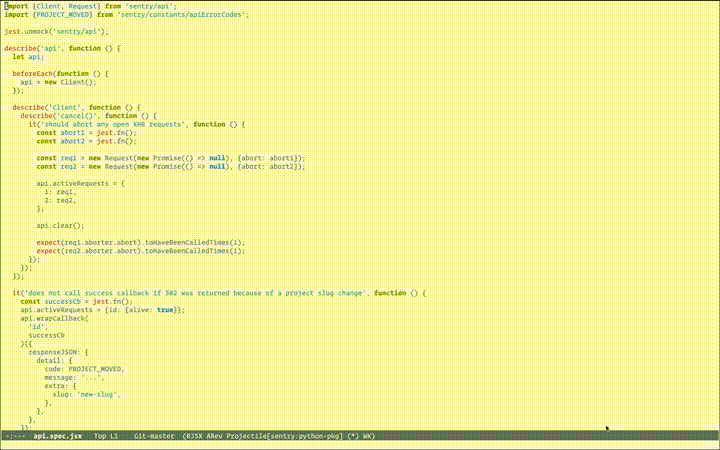

# emacs-jest

This package provides a way to work with [jest](https://jestjs.io/) in [emacs](https://www.gnu.org/software/emacs/)

## Usage

This package introduces a handful of functions for working with jest including:

[Author note: For snippets that could be helpful with the below functions, check out [helpful scripts](#helpful-scripts)]

### `jest-test-current-file`

This takes the current test file and tests it by taking the jest command output into a compilation buffer (check out [this blog post](https://erick.navarro.io/blog/using-compilation-mode-to-run-all-the-things/) to see more cool usages of `M-x compile`)


## Customization

To customize the variables below, `M-x customize-group RET jest RET`

### jest-coverage-directory

This is the directory that the root `index.html` file is expected (Important: without trailing slash). For `html` coverage reports, this is simply the `coverageDirectory` value in your jest config file. For `lcov` coverage reports, this is the `coverageDirectory` value concatenated with `"/lcov-report"`.

## Helpful scripts

### Making keybinds to quickly access functions

Typing out `M-x jest-get-coverage RET` every time you want to view code coverage results may be a bit much if you're frequently iterating. To find a keybind or chord that isn't claimed by a function, you can do `C-h k <keybind or chord>` to see if it's associated with something.


Above I'm showing that the keybind `C-:` (press `Control` then `:`) is unclaimed and can have a function associated with it. To associate it with `jest-get-coverage`, it's simply a matter of adding a line to your emacs init file (looks like `~/.emacs` or `~/.emacs.d/init.el`)

```elisp
(global-set-key (kbd "C-:") 'jest-get-coverage)
```

So now whenever I want to pop into the code coverage for the current project, I just press `C-:`



### Working with cells

When presenting code coverage in an org-table, you may want to modify column width but still be able to access cell info. To do so, you can add something like the following to your `init.el` file

```elisp
(defun get-cell-info ()
  (interactive)
  (when (org-table-p)
    (let ((filename (org-table-get nil 1))
	  (column-name (org-table-get 1 nil)))
      (message (string-join (list filename column-name) " - ")))))

(global-set-key (kbd "C-c i") 'get-cell-info)
```

So that you can modify column width using [`<N>` notation](https://orgmode.org/manual/Column-Width-and-Alignment.html) and then press `C-c i` from within the cell you're in and see a message displaying information about the cell

TODO - insert screenshot here

## TODO

- [ ] Store historical values (ses files/coverage reports)
- [ ] Make PR to add to Melpa!
